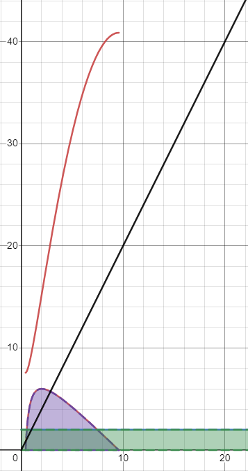

## Investment
Learning a new UI framework is an investment. Like learning how to use any tool there is a learning curve. It will take time to be comfortable with a UI framework and even more time to master it. Just like with learning any new tool there is a “risk reward” relationship but rather than risk and reward it is time (and maybe money) vs. the.One example non-learning related is a washing machine. Washing machines are very expensive and purchasing one is not feasible for everyone. However, long term using a laundry mat will actually be more costly.

This is the same way learning new skills has to be viewed. Maybe it seems like a large investment upfront but, what is the end payoff going to be? Does it make it worth it? The answer varies. 

## how to decide

The image shows a graph with a hypothetical time cost for an activity given two approaches (y-axis hours spent, x-axis day). The first (the green shaded area) we can see takes constant time (2 hours per day) while the second (purple area) requires a large time investment at the beginning (like learning a new tool), however, reduces down to no time per day before day ten. Now we can take the integrals of the functions to get the cumulative time spent in each of the approaches. This is shown by the red an black lines. Black represents the first constant time approach and red represents the second approach. We can see that by day 21 our first constant time approach will actually have cost us more time over all.

So if the task is only something you would need to do for 10 days it would make sense to take the constant time approach, and if it is something that would take more than 21 days the second approach where a new skill is learned to eventually (by day ten) automate the work would be more time efficient in the long run.

This threshold is somewhere different for each individual circumstance. This is only an example to convey the idea rather than the relationship using a UI framework versus using plain HTML and CSS has.

The example relationship above assumes that the more time intensive (learning a new tool) requires less time once mastered than the constant time (using already possessed knowledge). In fact, in that example by day 10 the task has been automated and requires no time. This is of course a rudimentary example and does not directly map to every situation.

