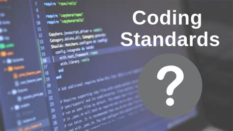

## What are coding standards
Coding standards are a set of guidelines to ensure that code is written in a consistent manner. For example, is there a space after commas when creating a numpy array in Python. The argument is not whether you should, objectively, have a space after the comma but rather that you should choose a way to do it and stick with it. The consistency is of more importance than the guidelines themselves. 
## My experience with coding standards
My first exposure to coding was through an undergraduate research assistant job in a public health office. I was working on the analytics team using the R programming language to automate analysis of publicly-available data. Most of the members of this team did not have formal training in programming (me included at the time). Due to this there was no use of coding standards; you could easily tell who had written each portion of the projects. My first real experience with coding standards was commenting functions in Java as I took my first few computer science classes. However, none of my experiences have been as in depth as using ESLint as a coding standard framework.
## Why coding standards
One aspect of coding standards that I feel is most important is commenting, leaving messages for future readers of the script denoting what is happening especially for more complicated code chunks. During my aforementioned job without coding standards there were many times where I was required to decipher code written by another with no comments; this ultimately led to much time wasted which could have been avoided had coding standards been implemented. As mentioned before, commenting functions is not something I learned until I was exposed to it through classes but this immediately became a must for me. Many times I have worked with uncommitted functions where it takes running the function and printing the variables to conclude what each input argument represents. Due to this I implemented loose coding standards for the analytics team at my old job to ensure at a minimum functions would be commented on.
## My future with coding standards
As I continue my academic and professional career I continue to not only use coding standards for myself but also strive to implement them in the teams I am working on (if they are not already present). For me, my interest is in machine learning applications in the natural sciences especially the climate sciences. Owing to this I find myself working on coding projects with interdisciplinary teams where coding standards are not common knowledge. I will continue to learn about coding standards to ensure I can bring these standards to my future projects.
