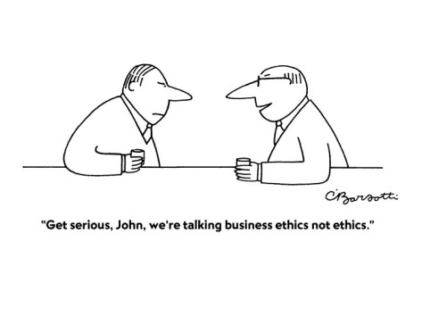

---
layout: essay
type: essay
title: "Beyond Web Development: Valuable Lessons in Software Engineering"
# All dates must be YYYY-MM-DD format!
date: 2023-05-05
published: true
labels:
  - Software Engineering
  - Ethics
  - Configuration Management
  - Team Work
---

Throughout my software engineering course, I have learned a great deal about software engineering; beyond just web application development. Specifically, three concepts stood out to me: configuration management, working on a team, and ethics in software development.

## Configuration Management

Configuration management is the practice of tracking and controlling changes to software and hardware throughout the software development lifecycle. This means managing code, documentation, and other artifacts so that changes can be made safely. While this concept is crucial for web application development (especially on a team), it also has broader applications in the field of data science and machine learning. In these areas, it is important to keep track of changes to datasets, data frameworks, and models to ensure reproducibility and maintainability. I already use the configuration management tools I have learned in my software engineering at work where I have solo projects and team projects working with large image data sets (satellite imagery and natural images).

## Team Work

Working on a team was also a key aspect of the course. During our collaborative final project where we designed a webpage we learned how to communicate effectively so that efforts were not duplicated and we did not step on each other’s toes. One of the research projects I work on I am developing a machine learning framework that analyzes satellite imagery; when I first started I was working on it alone and I did not have to worry about communication besides communicating what I had accomplished. Now the framework I made is being used and worked on collaboratively by multiple people and communication has become essential to make sure we are not overwriting each others' changes or duplicating efforts. This process has been made easier thanks to the configuration management platform git which we are using and the rule that every time you start working you update your project with any edits from others and at the end of your work you update the main project with your changes. 

## Ethics
While I was growing up my mom worked in public health for the government and she instilled in me that life is about making the world a better place and helping others. I still remember as a kid the first time I found out that hospitals were for-profit organizations. It made no sense to me, health care is a necessity shouldn't the sole purpose of hospitals be to help people? I know that I will have ethical dilemmas in my career, especially working in artificial intelligence and I feel my software engineering course’s ethics section taught me how to make decisions around ethics in my career and also to respect the decisions others make.

In conclusion, my software engineering course at the University of Hawiʻi at Mānoa Information and Computer Sciences Department has prepared me for my career from working on a team to managing large code bases and making hard ethical decisions. 

