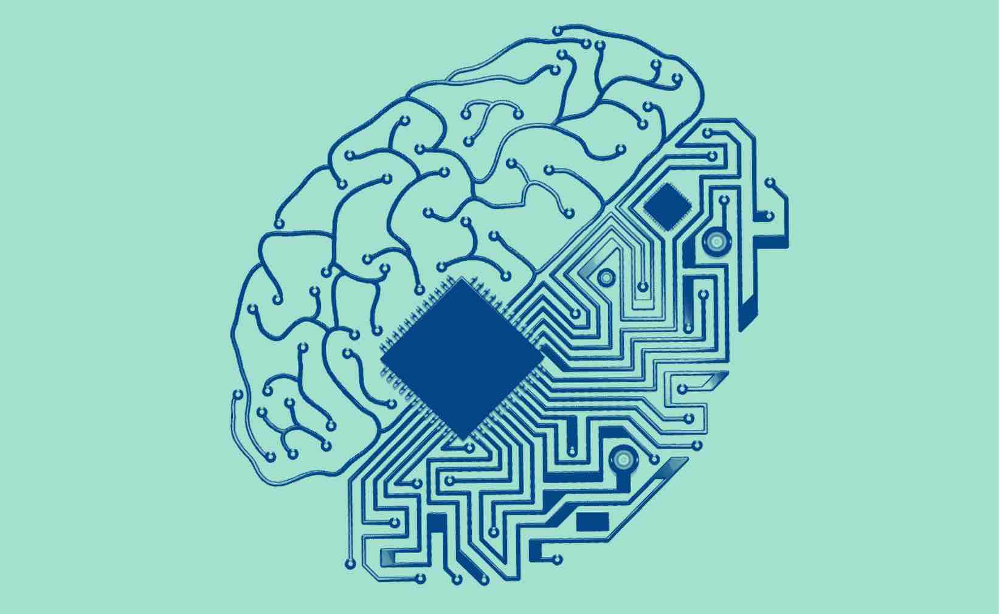

## My Introduction to Programming
When starting at the University of Hawaiʻi at Mānoa I was conflicted between majoring in public health and natural resources and environmental management. I ended up choosing to start my college career in public health though I still had a strong interest in the natural sciences. During my first semester I started working at the Pacific Health Analytics Collaborative. At this position I had my first experience with programming. There I worked in the R programming language. This experience made me realize that I wanted to pursue the data science side of public health. However, the PI of that collaborative recommended that I switch to Computer Science so that I am not pigeon-holed in the public health field and that I could work as a data scientist in any field. 
## How my Interests Morphed Throught My Change to Computer Science
The second semester of my freshman year I declared computer science as a second major. During this semester I had a general education course in the geography department; the professor mentioned meteorological equipment on mount Kaʻala, Oʻahu’s highest peak and a mountain that I had previously worked on for a conservation internship in high school. Owing to my interest in the mountain and the natural sciences I asked the professor if I could help automate his data analysis pipeline. Through this experience I was first exposed to the field of Machine learning and from then on it has been a passion of mine. 
## Then I found Machine learning
I am very interested in applications of data science and specifically machine learning in the climate sciences. I am currently working as an introductory remote sensing specialist at the Climate Resilience Collaborative in the School of Ocean and Earth Science and Technology where I have been able to both explore more applications of machine learning and also working with geospatial data with a goal of community betterment. 
## There is still much to learn
The more experiences I have and the more classes I take the more I realize there is to learn. One area that is general to all computer science that I feel weak in is the use of software environments as well as more in depth IDEs such as Intellij and PyCharm (by the same company). I tend to focus on coding rather than setting up the tools to do so such as using different IDEs. This is a shortcoming of mine that I will work to improve starting now with the ICS 314 course at the University of Hawaiʻi as well as using the Mana - the High Performance Computing Cluster at the University of Hawaiʻi for computer vision tasks.
