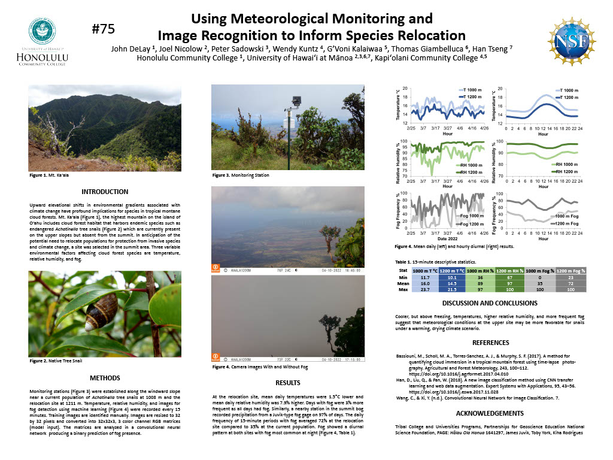

Computer vision techniques implemented in Python to monitor fog in trail camera images. The resulting data was coupled with other meteorlogic data to inform relocation of native snails on the slopes of Mount Kaʻala Oʻahu’s highest Mountain.
