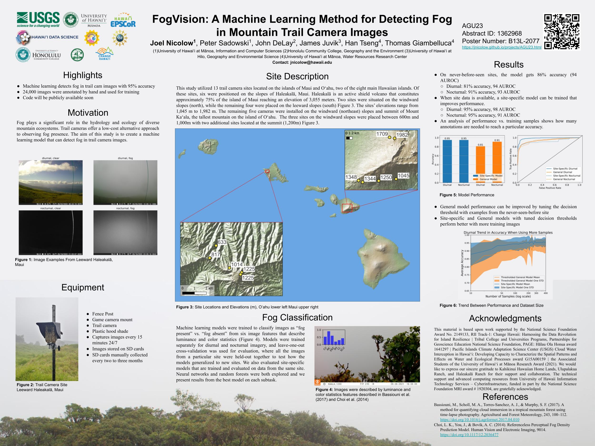

This webpage provides more information on my AGU poster  
FogVision: A Machine Learning Method for Detecting Fog in Mountain Trail Camera Images  
[Joel Nicolow](https://jnicolow.github.io/)  
[jnicolow@hawaii.edu](jnicolow@hawaii.edu)  
[View pdf](https://github.com/jnicolow/jnicolow.github.io/blob/main/img/agu23/AGU2023poster_nicolow_joel.pdf)

