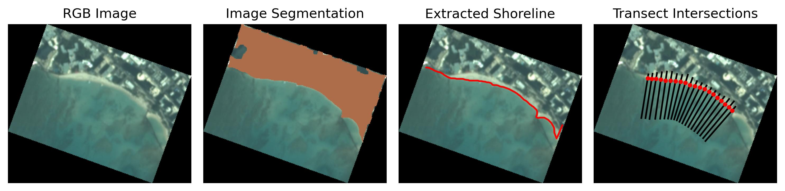

CoastVision is an open-source Python framework geared towards generating satellite-derived shorelines (SDS) in <a href="https://developers.planet.com/docs/data/planetscope/">PlanetScope</a> imagery. Given a time window and an area of interest (AOI) CoastVision will download applicable PlanetScope satellite imagery, extract shorelines, and compute transect intersections.

CoastVision is inspired by <a href="https://github.com/kvos/CoastSat">CoastSat</a> and <a href="https://github.com/ydoherty/CoastSat.PlanetScope">CoastSat.PlanetScope</a> with the key differences being CoastVision's inclusion of an API to download PlanetScope imagery and how shoreline contours are extracted. CoastSat.PlanetScope classifies each pixel as white-water, water, sand, or other land; then using a thresholding algorithm such as peak fraction on the normalized difference water index. CoastVision classifies pixels as either land or water and then uses the marching squares algorithm to delineate a shoreline between the land and water classes.

 
Github Repo: <a href="https://github.com/Climate-Resilience-Collaborative/CoastVision">https://github.com/Climate-Resilience-Collaborative/CoastVision</a>
