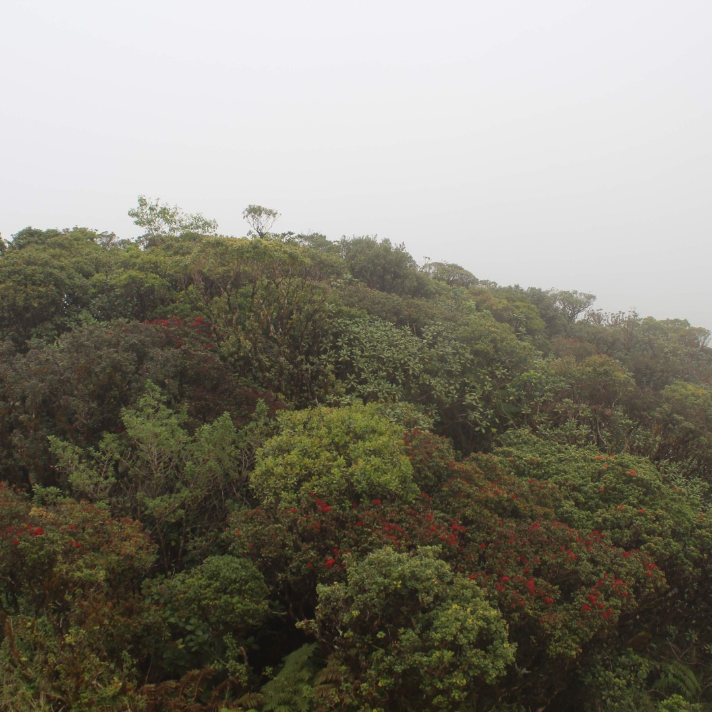

There is a saying in Hawaiʻi (and elsewhere) “the mountains make the cloud”. This is in reference to oragraphic lift where as air is pushed up a mountains slopes the temperature decreases hightening the relative humidity until clouds are formed. This proces is a very important source of water in Hawaiʻi. 

It is important to study these gradients along with the fog created by these gradients in order to understand what the affects of changing temperature profiles due to climate change might entail.

Four monitoring stations were established on the upper windward slopes of Mount Kaʻala at 200 meter intervals between 600 meters and 1200 meters. This range encompassed elevations where fog was thought to be frequent. Each station included a trail camera and a temperature relative humidity sensor in a solar radiation shield mounted at 1.5 meters above the ground. Pictures and meteorological variables were recorded at 15-minute intervals. 2592 measurements were recorded for each site and variable. Fog presence was manually identified from a sample set of pictures which were then used to train a convolutional neural network to preform a binary classification of fog presence.

This work was presented at the American Geophysical Union Fall meeting in 2022 (virtual) https://agu2022fallmeeting-agu.ipostersessions.com/Default.aspx?s=E6-2A-D7-F0-F6-E6-F4-00-C6-A0-30-24-43-CE-7B-82.

