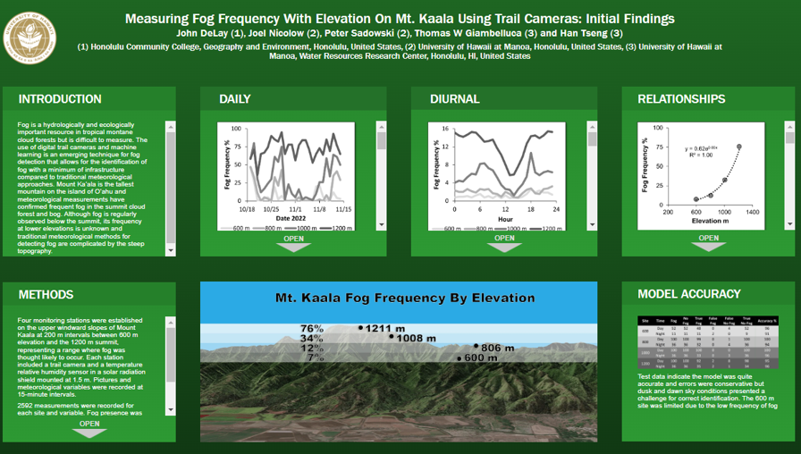

Using data collected by cameras on the slopes of Mount Kaʻala Oʻahu’s highest peak I created a model to predict fog pressense. For this project I used Python and the deep learning library PyTorch. This research was presented virtually at the American Geophysical Union’s Fall meeting.
