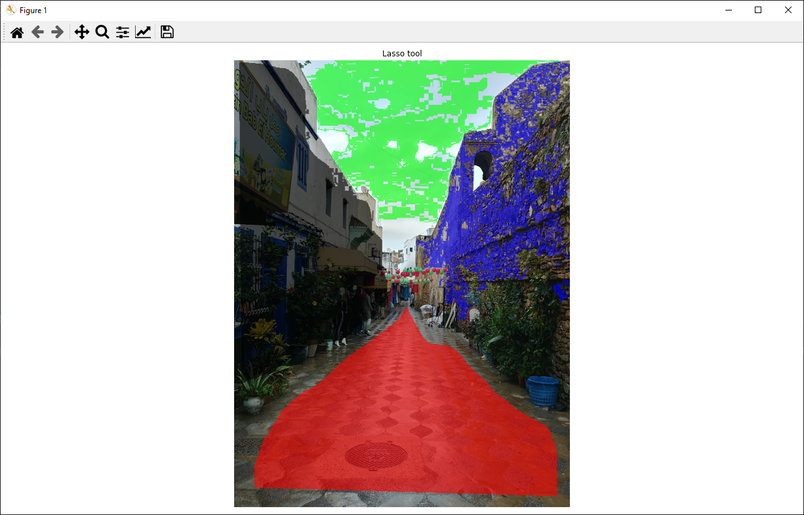

This is an open source pixel annotation tool written in Python. The tool allows you hand classify single pixels, use a flood fill tool, and/or a lasso tool. The code is available [here](https://github.com/jnicolow/Python-pixel-classification-tool) (and more information).

