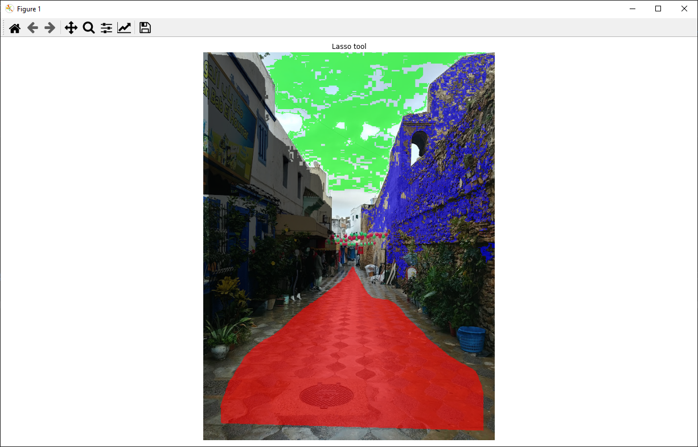

This is an open-source pixel annotation tool written in Python. This tool allows you to select pixels using flood fill, a lasso tool, and/or selecting single pixels. The code is available [here](https://github.com/jnicolow/Python-pixel-annotation-tool) (along with more information).

