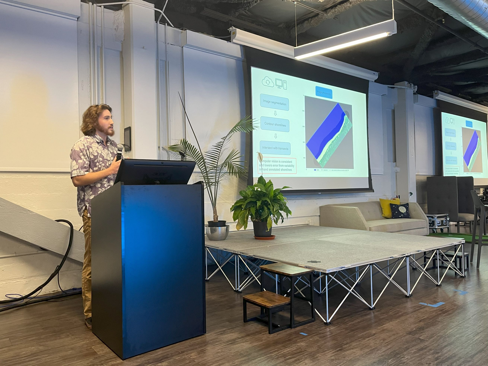

On December 12th, 2023 I gave a lightning talk at [Planet](https://www.planet.com/company/) Headquarters in San Francisco on how we at the [Coastal Research Collaborative](https://www.soest.hawaii.edu/crc/) user their satellite imagery to monitor coastal erosion along sandy coastlines.

