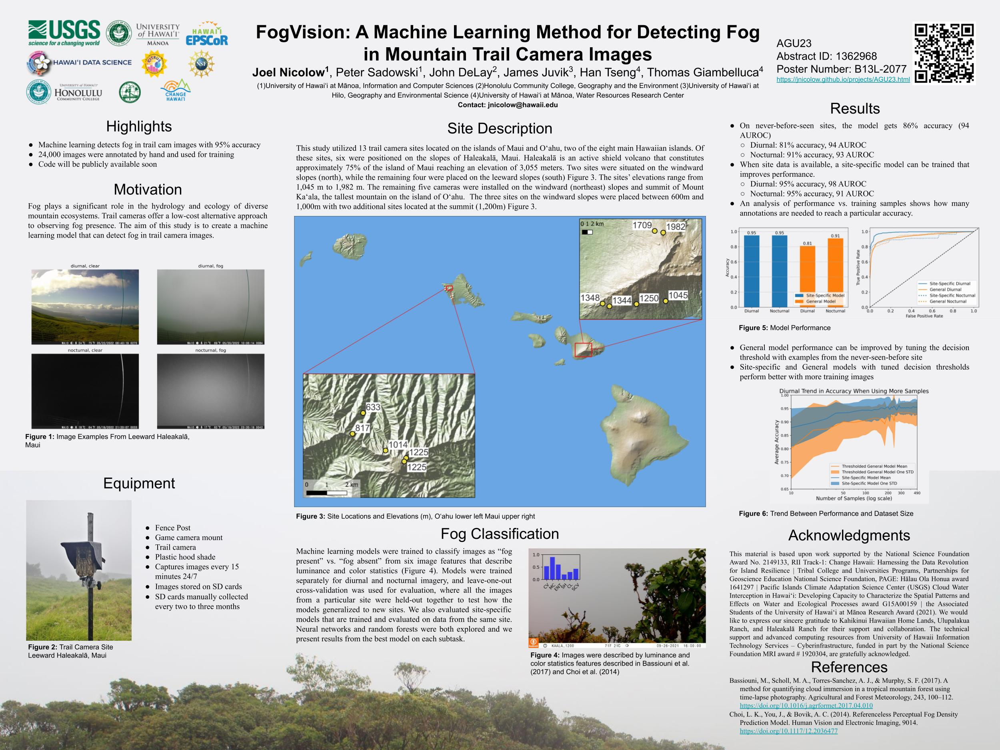

Nicolow, J., Sadowski, P., DeLay, J., Juvik, J., T., Tseng, H., & G., Giambelluca (2023). FogVision: A Machine Learning Method for Detecting Fog in Mountain Trail Camera Images. American Geophysical Union.
https://jnicolow.github.io/projects/AGU23.html

