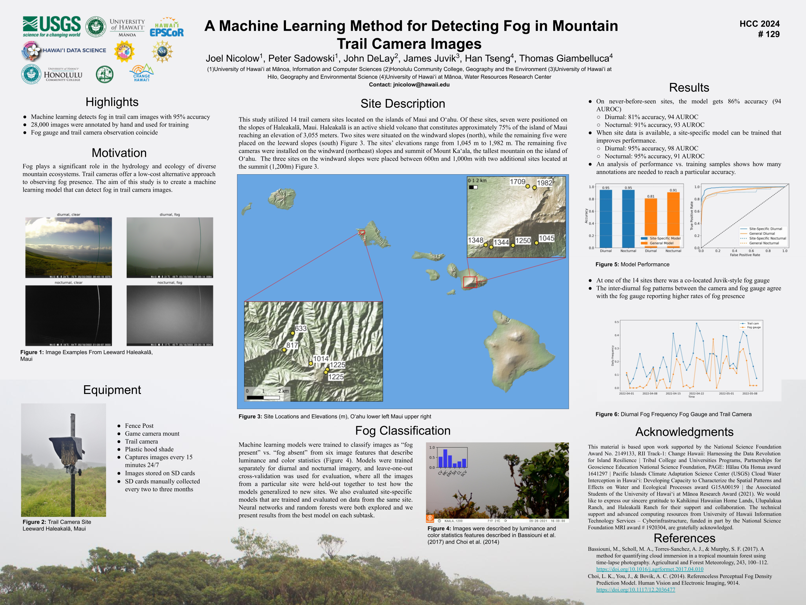

**Nicolow, J.**, Sadowski, P., DeLay, J., Juvik, J., T., Tseng, H., & G., Giambelluca (2024). A Machine Learning Method for Detecting Fog in Mountain Trail Camera Images. Hawai‘i Conservation Conference.

